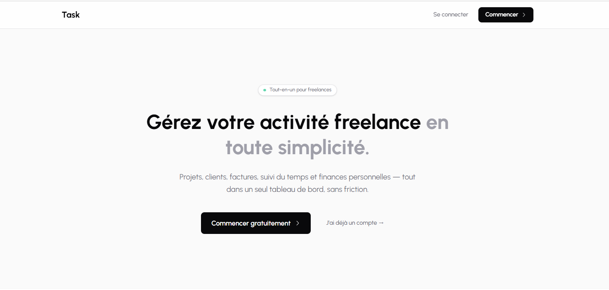

# Task



**Task** is an all-in-one management app for freelancers — projects, clients, invoices, time tracking, and personal finance, all in one dashboard.

---

## Features

| Module | Description |
|---|---|
| **Dashboard** | Overview of active projects, pending invoices, and financial KPIs |
| **Projects** | Track status, budget, hourly rate, and deadlines |
| **Clients** | Centralize contacts and collaboration history |
| **Invoices** | Auto-numbered invoices (INV-YYYY-NNNN), PDF export, overdue detection |
| **Tasks** | Organize work by priority, status, and linked project |
| **Time tracking** | Timer per project/task, billable hours tracking |
| **Finance** | Revenue (realized/pending/projected), expenses, debts & receivables |

---

## Tech Stack

- **Framework** — [React Router v7](https://reactrouter.com) (SSR, file-based routing)
- **Backend / Auth / DB** — [Supabase](https://supabase.com) (PostgreSQL + RLS + Auth)
- **Styling** — [Tailwind CSS v4](https://tailwindcss.com) (no config file, `@import "tailwindcss"`)
- **Icons** — [iconsax-react](https://iconsax-react.pages.dev/)
- **PDF** — [@react-pdf/renderer](https://react-pdf.org/)
- **Language** — TypeScript (strict mode)
- **Package manager** — pnpm

---

## Getting Started

### Prerequisites

- Node.js 20+
- pnpm
- A [Supabase](https://supabase.com) project

### Installation

```bash
git clone <repo-url>
cd task
pnpm install
```

### Environment variables

Create a `.env` file at the root:

```env
VITE_SUPABASE_URL=https://your-project.supabase.co
VITE_SUPABASE_ANON_KEY=your-anon-key
```

### Database

Apply the migrations to your Supabase project via the Supabase dashboard or CLI:

```bash
supabase db push
```

### Development

```bash
pnpm dev        # Start dev server → http://localhost:5173
pnpm build      # Production build
pnpm start      # Serve production build
pnpm typecheck  # TypeScript check
```

---

## Project Structure

```
app/
├── routes/
│   ├── _layout.tsx               # Root layout (sidebar + auth guard)
│   ├── _marketing._index.tsx     # Landing page (public)
│   ├── dashboard.tsx
│   ├── clients/
│   ├── projects/
│   ├── tasks/
│   ├── invoices/
│   ├── time-entries/
│   └── finance/
│       ├── index.tsx             # Finance dashboard
│       ├── expenses/
│       ├── debts/
│       └── income/
├── components/
│   ├── ui/                       # Button, Badge, Input, Card, Modal…
│   ├── layout/                   # Sidebar, PageHeader, MobileHeader
│   ├── invoices/                 # InvoicePDFDocument, InvoiceTable…
│   └── finance/                  # BalanceWidget, StatCard…
├── lib/
│   ├── supabase.ts
│   ├── context/                  # CurrencyProvider, ToastProvider, ConfirmProvider
│   └── utils/
│       ├── invoice.ts            # generateInvoiceNumber(), calculateInvoiceTotals()
│       ├── finance.ts            # getPaidRevenue(), getFinanceSummary()…
│       └── dates.ts
└── types/
    └── database.ts               # Auto-generated from Supabase CLI
```

---

## Database Schema

### Core tables

| Table | Key columns |
|---|---|
| `clients` | `name`, `email`, `company`, `phone`, `address` |
| `projects` | `name`, `status`, `hourly_rate`, `fixed_price`, `budget`, `client_id` |
| `tasks` | `title`, `status`, `priority`, `due_date`, `project_id` |
| `time_entries` | `started_at`, `ended_at`, `duration_minutes`, `is_billable` |
| `invoices` | `invoice_number`, `status`, `due_date`, `total`, `currency` |
| `invoice_items` | `description`, `quantity`, `unit_price`, `total` |

### Finance tables

| Table | Key columns |
|---|---|
| `expenses` | `amount`, `date`, `category_id`, `payment_method`, `is_business` |
| `expense_categories` | `name`, `color`, `icon` |
| `debts` | `person_name`, `amount`, `amount_paid`, `status`, `due_date` |
| `debt_payments` | `amount`, `paid_at`, `debt_id` |
| `income` | `source`, `amount`, `date`, `invoice_id` (nullable) |
| `user_profiles` | `company_name`, `company_email`, `company_address`, `company_siret` |

All tables have **Row Level Security (RLS)** enabled — every query is scoped to `auth.uid() = user_id`.

---

## Key Business Logic

### Invoice numbering

Auto-generated format: `INV-YYYY-NNNN` (sequential per user per year).
Always use `generateInvoiceNumber(userId)` from `app/lib/utils/invoice.ts` — never hardcode.

### Overdue detection

An invoice becomes overdue when `status = 'sent'` and `due_date < today`. Detection runs client-side on the invoices list view.

### Invoice → Income auto-sync

When an invoice transitions to `paid`, an entry is automatically created in the `income` table (linked via `invoice_id`) to avoid manual duplication.

### Multi-currency

Supported currencies: EUR, USD, XOF. User preference is stored in `localStorage` (`task_currency`) and read via the `useCurrency()` hook.

### Finance summary

`getFinanceSummary(userId)` aggregates in parallel:
- **Realized revenue** — paid invoices
- **Pending revenue** — sent invoices awaiting payment
- **Projected revenue** — active/draft projects not yet invoiced
- **Net balance** — paid revenue + manual income − expenses

---

## Design System

- **Palette** — neutral zinc scale, light mode only (no `dark:` variants)
- **Font** — [Urbanist](https://fonts.google.com/specimen/Urbanist) (Google Fonts)
- **Background** — `bg-zinc-50` on pages, `bg-white` on surfaces
- **Borders** — `border-zinc-200` everywhere
- **Components** — all custom-built in `app/components/ui/` (no Shadcn, no Radix)
- **Language** — all UI text is in **French**

---

## Architecture Notes

- **Loaders** handle all data fetching — no `useEffect` + fetch
- **Actions** handle all mutations via `<Form method="post">`
- **`useFetcher`** for mutations that don't trigger navigation (e.g. marking a task done)
- **`supabase.auth.getUser()`** is called in every loader — never `getSession()`
- **Routing** uses declarative config in `app/routes.ts` (`layout()`, `route()`, `index()`) — not `flatRoutes()`
- **PDF generation** uses dynamic import in the click handler to avoid SSR issues

---

## License

Private — all rights reserved.
